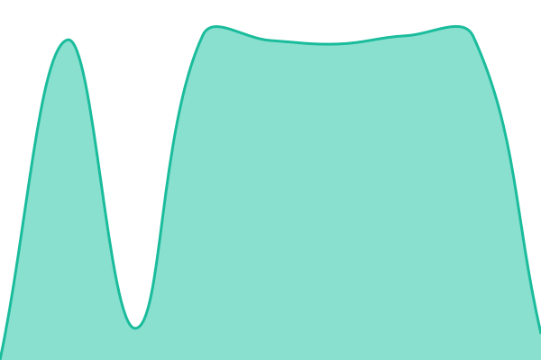
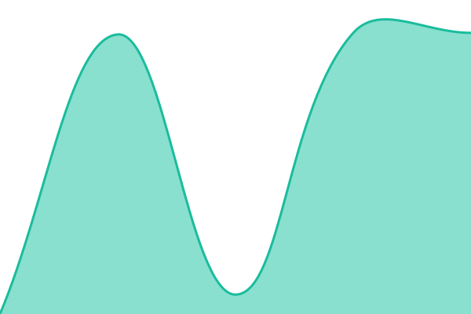
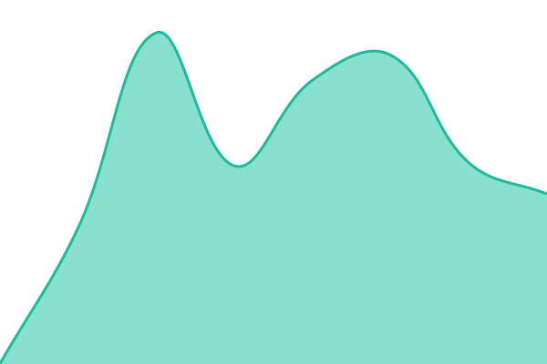

# [📈 Live Status](https://earthworksinc.github.io/oniyx): <!--live status--> **🟩 All systems operational**

This repository contains the open-source uptime monitor and status page for [thearthworks](www.thearthworks.com), powered by [Upptime](https://github.com/upptime/upptime).

With [Upptime](https://upptime.js.org), you can get your own unlimited and free uptime monitor and status page, powered entirely by a GitHub repository. We use [Issues](https://github.com/earthworksinc/oniyx/issues) as incident reports, [Actions](https://github.com/earthworksinc/oniyx/actions) as uptime monitors, and [Pages](https://earthworksinc.github.io/oniyx) for the status page.

<!--start: status pages-->
<!-- This summary is generated by Upptime (https://github.com/upptime/upptime) -->
<!-- Do not edit this manually, your changes will be overwritten -->
<!-- prettier-ignore -->
| URL | Status | History | Response Time | Uptime |
| --- | ------ | ------- | ------------- | ------ |
|  [Oniyx](https://sub.oniyx.io) | 🟩 Up | [oniyx.yml](https://github.com/earthworksinc/oniyx/commits/HEAD/history/oniyx.yml) | 

 9474ms
     
 | 

<a href="https://earthworksinc.github.io/oniyx/history/oniyx">100.00%</a>
    

|  [Century HVAC](https://century-hvac.ca) | 🟩 Up | [century-hvac.yml](https://github.com/earthworksinc/oniyx/commits/HEAD/history/century-hvac.yml) | 

 6686ms
     
 | 

<a href="https://earthworksinc.github.io/oniyx/history/century-hvac">100.00%</a>
    

|  [Own Travel](https://owntravel.ca) | 🟩 Up | [own-travel.yml](https://github.com/earthworksinc/oniyx/commits/HEAD/history/own-travel.yml) | 

 329ms
     
 | 

<a href="https://earthworksinc.github.io/oniyx/history/own-travel">100.00%</a>
    

|  [Web App](https://app.oniyx.io) | 🟩 Up | [web-app.yml](https://github.com/earthworksinc/oniyx/commits/HEAD/history/web-app.yml) | 

 484ms
     
 | 

<a href="https://earthworksinc.github.io/oniyx/history/web-app">100.00%</a>
    

<!--end: status pages-->

[**Visit our status website →**](https://earthworksinc.github.io/oniyx)

## 📄 License

- Powered by: [Upptime](https://github.com/upptime/upptime)
- Code: [MIT](./LICENSE) © [Anand Chowdhary](https://anandchowdhary.com), supported by [Pabio](https://pabio.com)
- Data in the `./history` directory: [Open Database License](https://opendatacommons.org/licenses/odbl/1-0/)
